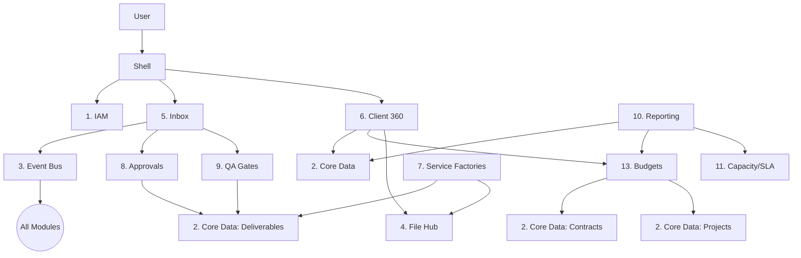

# BundlrOS Module Dependency Graph

## Visual Graph

## Layers

1. **Presentation Layer**: Shell, Unified Inbox, Client 360, Reporting.
2. **Business Process Layer**: Approvals, QA, Budgets, Service Factories.
3. **Core Data Layer**: Core Data Model, IAM, File Asset Hub.
4. **Infrastructure Layer**: Event Bus (Module 3), Admin Hub (Module 12).

## Critical Paths

- **New Client**: `IAM` -> `Core` -> `File Hub` (Logo) -> `Event:client.created`.
- **New Deliverable**: `Factory` -> `Core` -> `Event:deliverable.created` -> `SLA` -> `Inbox` (Notification).
- **Publish**: `Core(status:ready)` -> `Event` -> `Approvals` -> `QA` -> `Core(status:published)`.
